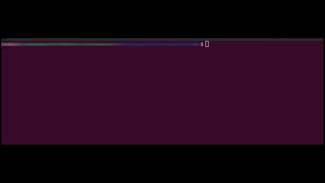

## Space invader meets Rust 



### Installation

Install rust if not already available

```
curl --proto '=https' --tlsv1.2 -sSf https://sh.rustup.rs | sh
```
### Getting started

```
cargo run
```


#### TODO
- [ ] Enemy counter attack
- [ ] Larger Projections for game
- [ ] Add sound
- [ ] Add bigger timebased beam weapons
- [ ] Add Game Menu
- [ ] Add apis to control remotely
- [ ] Websocket layer as alternative to apis
- [ ] Load sprites from files
- [ ] Integrate AI to plan and play against player
- [ ] Add a chat area between player and AI
- [ ] Convert to WASM
- [ ] Co-op Multiplayer mode

### Author
- [Muhammad Harris](https://www.linkedin.com/in/harris-perceptron/)

